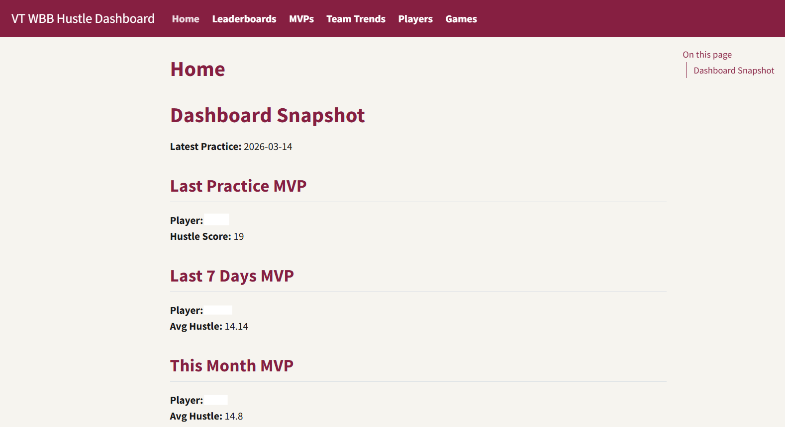
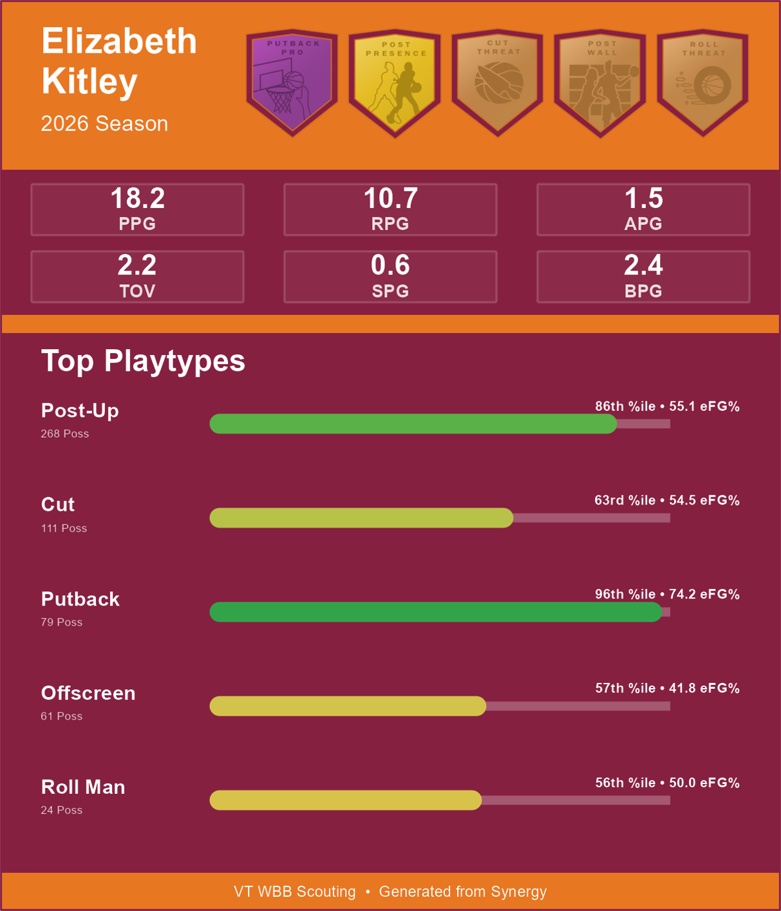
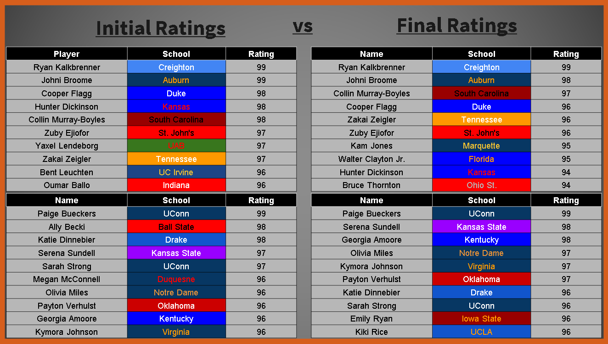
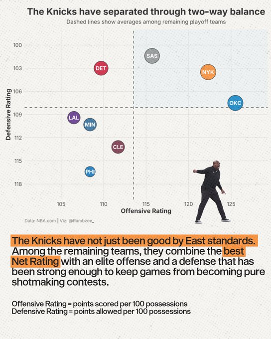
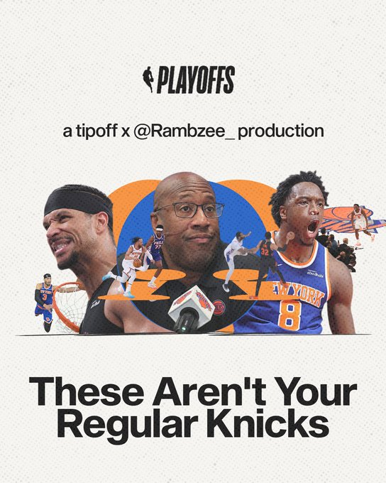

## Practice Hustle Dashboard

**Tools:** R, Quarto, Google Sheets API, Hudl Sportscode, OneDrive, ggplot2

Built a locally hosted web dashboard for Virginia Tech Women’s Basketball to turn daily practice tracking data into coach-facing summaries, leaderboards, trends, and player pages. The project addressed a workflow gap where hustle metrics were tracked every practice through Hudl Sportscode but stored across individual Google Sheets tabs without a centralized reporting system.

*Dashboard home page example. Player identifiers are anonymized in public materials to preserve team confidentiality.*

The site ingests practice data from Google Sheets, standardizes metrics such as assists, rebounds, deflections, steals, charges, loose balls, and turnovers, then renders a full Quarto website shared through OneDrive to protect proprietary team data.

**Highlights**

- Built pages for daily, weekly, and monthly MVPs, team trends, leaderboards, individual player summaries, and ACC opponent scout cards
- Automated ingestion from individual Google Sheets tabs into a structured reporting workflow
- Created player-level tables, averages, time series, and coach-facing summaries
- Hosted locally and shared through OneDrive to avoid exposing proprietary team data

---

## Scouting Card & Badge System

**Tools:** R, Photoshop, Synergy playtype data, ggplot2, image rendering, percentile grading

Designed and built a basketball scouting card system combining custom badge artwork, player evaluation logic, and automated card generation. I created each badge and tier individually in Photoshop, drawing inspiration from NBA 2K-style progression systems, basketball scouting graphics, and other sports design references.

The R pipeline uses Synergy offensive and defensive playtype data to assign players to role-based badges, identify each player’s top five playtypes by possession volume, display efficiency context, and parse player identifiers from source file names to incorporate counting stats.

*Sample scouting card demonstrating the badge system, team-themed layout, and automated playtype visualization workflow.*

**Highlights**

- Designed original badge artwork and tier systems for offensive and defensive skills
- Built logic to assign badges using Synergy playtype efficiency, volume, and percentile thresholds
- Automated player cards with top playtypes, possessions, efficiency, counting stats, and team colors
- Integrated visual design and basketball evaluation into a reusable scouting workflow

---

## Context-Aware NCAA Basketball Player Ratings

**Tools:** R, randomForest, tidyverse, Bart Torvik data, ESPN/wehoop, hoopR, cbbdata, R Markdown

Built a context-aware player rating system for NCAA men’s and women’s basketball that converts box-score production into 2K-style 40–99 ratings, then adjusts those ratings for team strength, schedule difficulty, and conference context.

The men’s pipeline used Bart Torvik player statistics joined with HDI ratings as a modeling baseline. The women’s pipeline used ESPN box-score data through `wehoop`, with season-level aggregation, team/conference mapping, and rating adjustments designed to make outputs more comparable across competitive environments.

Initial ratings were based primarily on player production and efficiency. Final ratings incorporated conference and schedule context, creating a more realistic comparison between high-major stars and high-output players from weaker leagues.

*Pipeline diagram showing how men’s and women’s player data were cleaned, modeled, adjusted for team and conference context, and converted into final 2K-style ratings.*

*Example rating comparison showing how the model moved from initial production-based ratings to final conference-adjusted ratings. Initial ratings were driven primarily by player statistical output, while final ratings incorporated team strength, schedule difficulty, and conference context.*

**Highlights**

- Trained a random forest model to estimate player ratings from box-score and efficiency statistics
- Built men’s and women’s pipelines using different data sources and normalization steps
- Applied team strength, schedule difficulty, and conference strength adjustments
- Produced final men’s and women’s 40–99 player rating tables
- Cleaned a messy class project into a professional GitHub repo with clear folders, scripts, outputs, reports, and documentation

[View project repository](https://github.com/CalebRProjects/NCAA-2K-Style-Ratings)

---

## TipOffBall NBA Analysis

**Tools:** R, NBA.com, Synergy, Cleaning the Glass, StatMuse, DataBallr, ggplot2, R Markdown

Produced 30+ NBA analysis projects turning basketball data into public-facing statistical stories. I gather data from sources like NBA.com, Cleaning the Glass, StatMuse, Synergy, DataBallr, and other basketball data tools, then use R to clean, organize, analyze, and visualize the findings behind written reports and social media threads.

*Example social graphic from a TipOffBall analysis. My role focused on data collection, R workflows, statistical framing, written findings, and the underlying chart/analysis.*

*Example cover graphic from the same project, showing how the analysis was packaged into a social-first basketball story.*

**Highlights**

- Built R workflows for NBA player and team analysis using public and proprietary basketball data sources
- Created data-backed stories on team performance, player development, playoff adjustments, trade fits, and player-specific trends
- Produced written reports and visual analysis that generated 250,000+ X impressions and 100,000+ Instagram engagements
- Collaborated with TipOffBall to turn statistical findings into social-first basketball content

[View NBA projects repository](https://github.com/CalebRProjects/2025-26NBAProjects)

---

## Additional Analytics Projects

### Shot Quality Pipeline

Early-stage proof-of-concept exploring how NBA Stats API play-by-play and shot chart data can be used to estimate contextual shot value beyond makes and misses. The current version is a rough meeting report rather than a finished model, but it shows the basic automation shell of pulling NBA games, extracting shot events, assigning proxy shot quality buckets, summarizing game-to-game trends, and adding a rough possession value layer.

**Tools:** R, NBA Stats API, play-by-play data, shot chart data, tidyverse, R Markdown

[View proof-of-concept PDF](assets/shot-quality-rough-concept-report.pdf)

### Insurance Risk Monte Carlo Simulation

Built an R simulation model to estimate five-year insurance solvency risk under heavy-tailed Pareto claim distributions. Compared reserve-retention and profit-taking policies, showing how bankruptcy risk increased from 16.3% to 34.3% when surplus capital was paid out annually.

**Tools:** R, tidyverse, Monte Carlo simulation, Pareto distributions, ggplot2

[View full project PDF](assets/insurance-monte-carlo-simulation.pdf)

### Employee Attrition Analysis

Analyzed employee attrition patterns across department, overtime status, tenure, income, and job role. The project used exploratory visualization and logistic regression to identify factors associated with higher attrition risk, with overtime standing out as the strongest predictor in the model.

**Tools:** R, tidyverse, ggplot2, logistic regression, R Markdown

[View project PDF](assets/employee-attrition-analysis.pdf)

### Survey Analysis Project

Group survey research project studying how online, in-person, and mixed communication channels relate to undergraduate friendship quality. My group designed the survey, collected the data, and developed the research questions together. My individual contributions focused on the statistical analysis, visualizations, and much of the results/writeup section.

**Tools:** R, QuestionPro, survey analysis, hypothesis testing, data visualization, report writing

[View project PDF](assets/final-survey-report.pdf)
